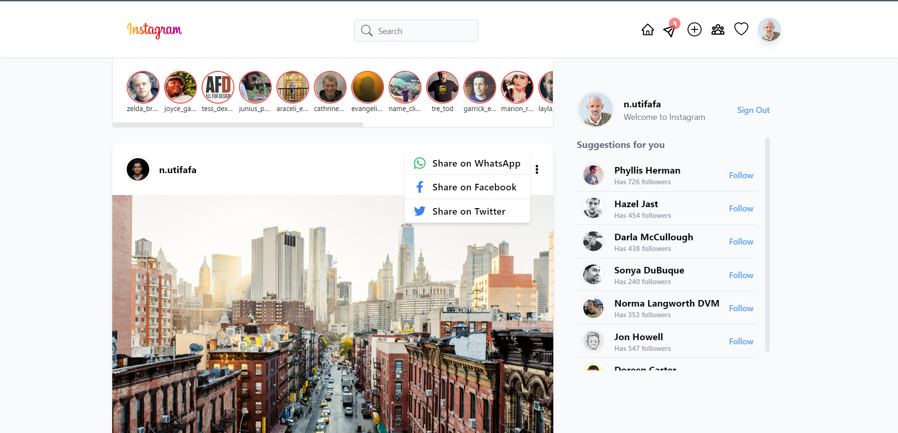

# Instagram
This is a clone of instagram built with:

## Dependencies
- [Tailwind Forms](https://github.com/tailwindlabs/tailwindcss-forms)
- [Tailwind CSS](https://tailwindcss.com/)
- [Tailwind Scrollbar](https://github.com/adoxography/tailwind-scrollbar)
- [Tailwind Scrollbar Hide](https://github.com/reslear/tailwind-scrollbar-hide)
- [FakerJS](https://fakerjs.dev/)
- [Firebase](https://firebase.google.com/)
- [NextAuthJs](https://github.com/nextauthjs/next-auth)
- [Recoil](https://recoiljs.org/)
- [Headless UI](https://headlessui.com/)
- [React Moment](https://www.npmjs.com/package/react-moment)

## Demo
Not avalable yet

## Preview

### Desktop

### Mobile

